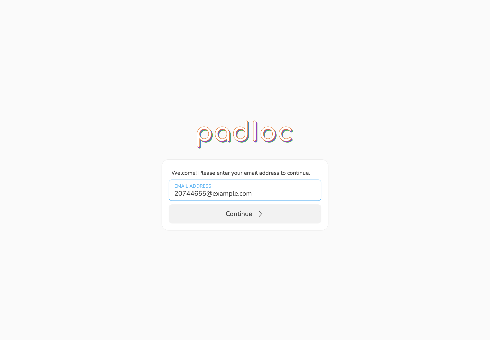
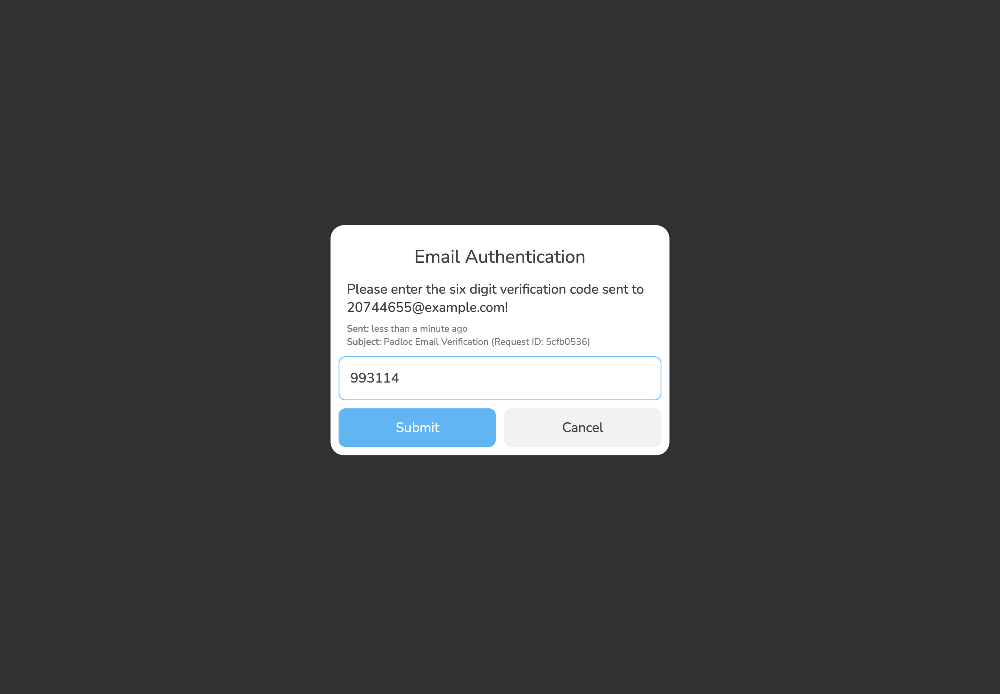
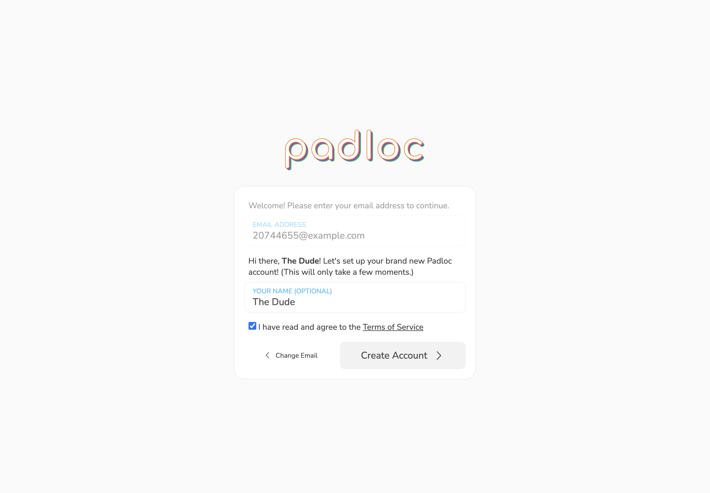
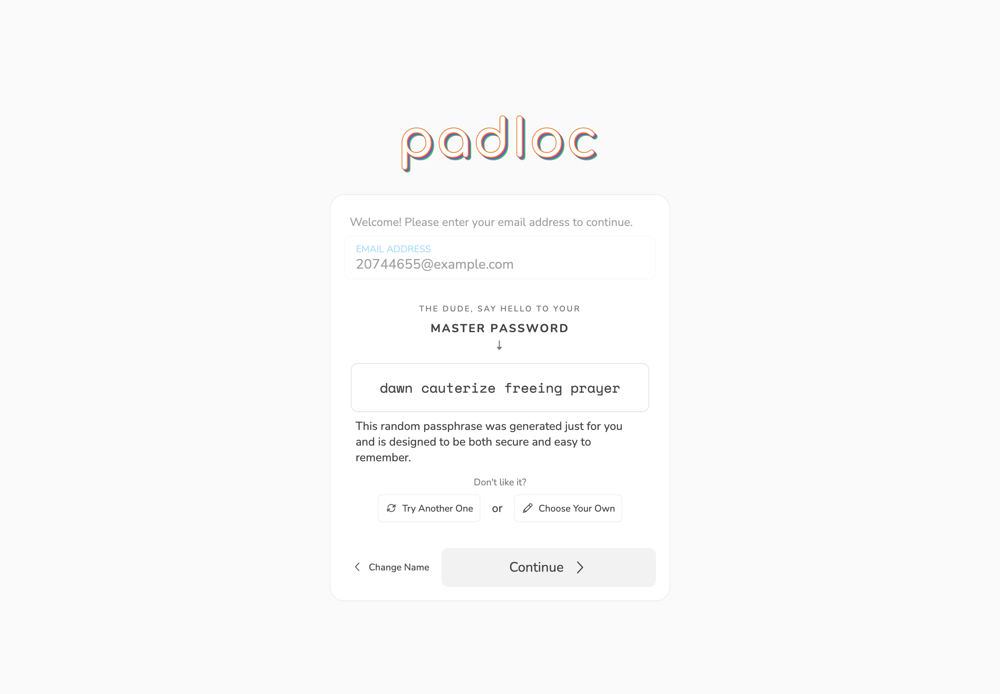
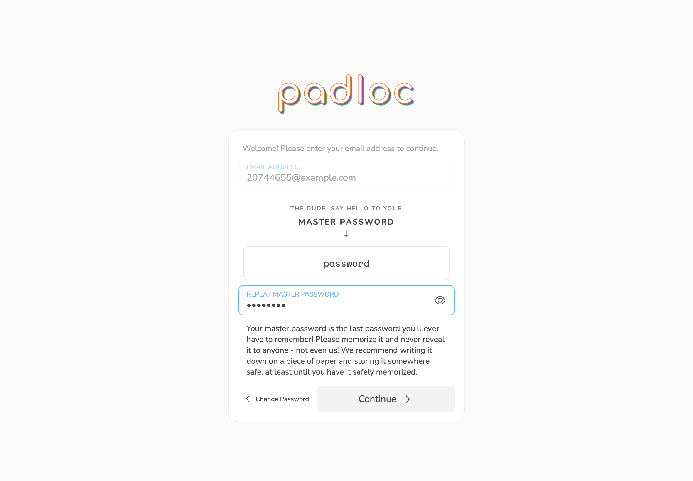
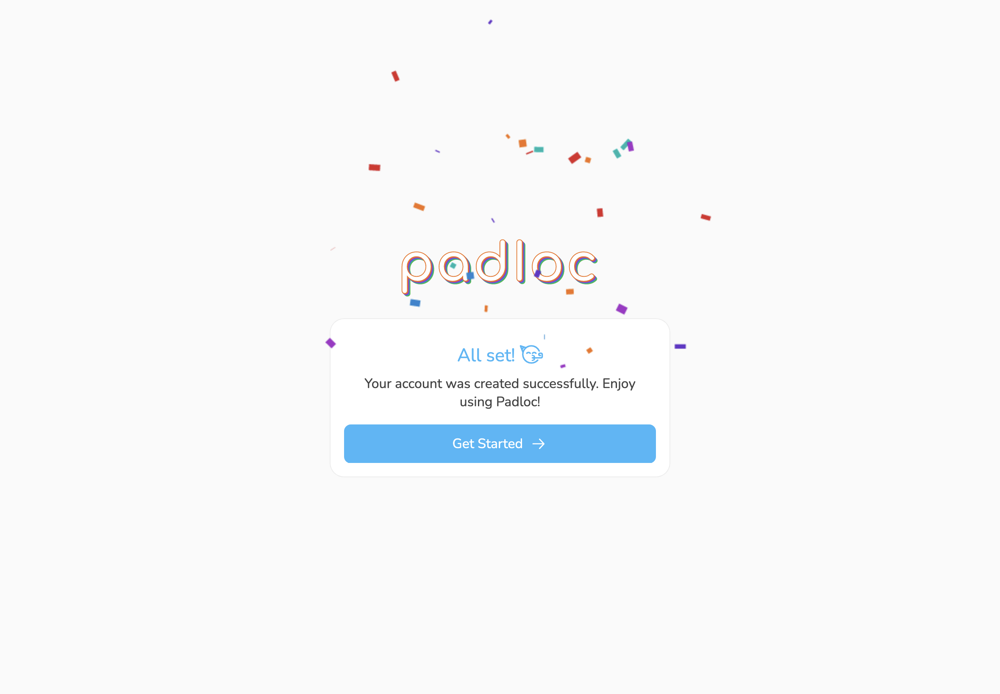

Creating a Padloc account is simple and takes only a few moments. To get
started, you can either open the Padloc web app by going to
[web.padloc.app](https://web.padloc.app) or by downloading and installing the
app. The first thing you'll see is the **start screen**.

## Step 1: Enter and confirm your email address

First, you'll be asked for an **email address**.

<figure>
    
    <figcaption>Start by entering your email address.</figcaption>
</figure>

Your **email address** is used as a username for logging into your account, as
well as as the standard delivery method for 2-factor authentication. We'll also
use this address to send you important updates about your account, organizations
you are a member of and various other things. For more information about how we
handle your email and other personal information, please refer to our [privacy
policy]({{ metadata.privacyPolicy }}).

Click Continue <i class="chevron-right"></i> to
proceed.

### Confirm your email address

As mentioned before, your email address will be used for things like two-factor
authentication and will generally identify your account within Padloc, so we
first need to make sure you actually own it. To do this, we will send you an
email with 6-digit confirmation code. To proceed, simply enter this code in the
provided field and click Submit.

> <i class="info-circle"></i> Note that email may take a few minutes before it
> shows up in your mailbox. You may also want to check your spam folder!

<figure>
    
    <figcaption>Confirm your email address by entering the confirmation code we'll send you.</figcaption>
</figure>

## Step 2: Accept Terms of Service

Tick the checkbox labeled **_<i class="square-check"></i> I have read and agree
to the [Terms of Service]({{ metadata.termsOfService }})_**.

<figure>
    
    <figcaption>Accept the Terms of Service by ticking the checkbox.</figcaption>
</figure>

At this point you may also enter a **display name** that will tell us how you'd
like to be referred to. This is especially useful in case you join any
organizations (like your shared Family account or Company) as it will make it
easier for others to identify you. This doesn't have to be your full or even
your real name and can be changed at any time later on. It is also completely
optional so you can just leave this empty for now if you want.

Once you've accepted the [Terms of Service]({{ metadata.termsOfService }}) and
(optionally) entered your display name, click Create
Account <i class="chevron-right"></i> to continue.

## Step 3: Choose your master password

**This is the most important step of the signup process** (don't worry, it is
also the last) so you should pay close attention to what is happening here. Your
**master password** is used to protect your account and all the information
stored within it and although we use always use strong encryption to protect
your data **this protection is only as strong as the master password you
choose**. At the same time, **we will never store a copy of your password
anywhere and will not be able to help you recover it** in case you forget it, so
you want to make sure to use something that is both hard to guess and easy to
remember.

### Option 1: Let us generate a master password for you

We know coming up with a secure, easy to remember password is not an easy task,
so we will assist you by suggesting a strong password for you to use. This is a
secure passphrase that is randomly generated from a list of the most common
words in the English language (or whichever language you have set in your system
preferences, as long as it is supported) using a variation of the
[diceware method](https://ssd.eff.org/en/module/animated-overview-how-make-super-secure-password-using-dice).
This passphrase may not look particularly secure, but we assure you it is likely
much better than anything you would come up by yourself (no offense) and it
certainly is a lot easier to remember than a string of random characters!

Don't like your suggested password? No problem! You can shuffle through more
random phrases by clicking <i class="refresh"></i>
Try Another One until you find one you like (the generator has been known
to spit out some hilarious combinations from time to time 😋).

<figure>
    
    <figcaption>Coming up with a good password is hard, but we've got you covered.</figcaption>
</figure>

### Option 2: Choose your own master password

If none of the suggested passwords work for you, you can choose a more hands-on
approach by selecting clicking
<i class="pencil-alt"></i> Choose Your Own.
This will present you with the option to pick a password entirely by yourself or
you can bring up a password generator that will give you much more control over
how the password is generated. You can even choose a different language or
increase the number of words used (4 words should be good enough for most people
but if you want to be safe, choosing 5, 6 or 7 words will make your password
even more secure).

Once you've chosen and memorized your master password, click
Continue <i class="chevron-right"></i> to proceed to
the next step.

## Step 4: Confirm your master password

Once you've chosen your master password, all that is left to do is to confirm it
by repeating it in the field below (peeking is allowed), then click
Continue <i class="chevron-right"></i>.

<blockquote class="red">

**<i class="exclamation-triangle"></i> Important**: As mentioned before, we
don't keep a copy of your master password anywhere and we won't be able to
recover it if you forget it! To be safe, we recommend writing it down on a piece
of paper and storing it somewhere save, at least until you've safely memorized
it. **Don't store your master password digitally in any form and don't tell it
to anybody else!**

</blockquote>

<figure>
    
    <figcaption>Confirm your master password by re-entering it.</figcaption>
</figure>

## Step 5: Celebrate

Time to break out the confetti! <i class="face-party"></i> You've just made your
first step towards a more secure digital life. Click
Get Started <i class="arrow-right"></i>
to dive right in! Now how about we continue by
[creating your first vault item](../vaults)?

<figure>
    
    <figcaption>Confirm your master password by re-entering it.</figcaption>
</figure>
