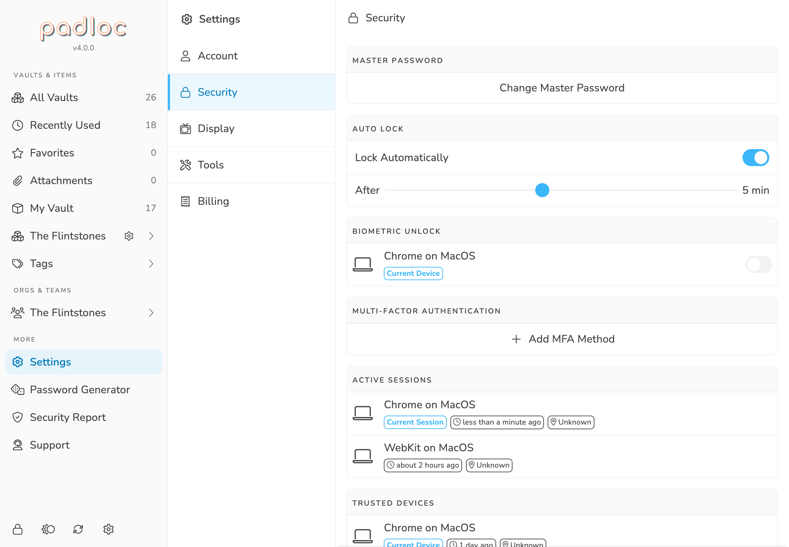

Locking allows you to make sure your master password is required in order to be
able to get access to your vaults and vault items again.

While you can lock and unlock Padloc manually, the apps also have an auto lock
feature, enabled by default, which ensures that if you leave your device
inactive for a few minutes, it will automatically lock.

<figure>
    
    <figcaption>
        In the security settings you can change your auto lock preferences.
    </figcaption>
</figure>

### Notes on security

When the application becomes locked, all references to unencrypted data are
deleted. However, like most other password managers which are based on browsers
and/or webviews, the application has no control over the retention of these
secrets in the process memory itself.

While this is common and generally accepted, we want to make sure it's
understood by our customers, for the sake of transparency.

> **NOTE:** The finding below is only relevant for the browser, Electron, and
> Tauri apps. Other versions aren't affected as they use separate processes and
> APIs to access memory.

With a simple test which involved taking memory dumps (`procdump`) of the
browser or webview process and using strings to extract known secrets,
[Radically Open Security](https://www.radicallyopensecurity.com/) noted that:

> It was found that secrets were prevalent in these dumps, even after locking
> the application. After closing the browser tab it was unpredictable when these
> memory areas were overwritten/inaccessible, but in practice they were retained
> at least several seconds to minutes.

> More sophisticated attacks do not require the above tooling and can be
> possibly executed from a malicious website or application opened in the same
> browser or system, or using memory side channels such (e.g.
> https://leaky.page/ ). Other scenarios would be shared devices (library,
> internet cafe, office, ...).

> Furthermore, no protections are in place to prevent secrets from being written
> to swap under memory pressure. A threat model where this is is relevant is
> e.g. an evil maid attack -- a computer may be turned off but secrets may have
> been written to unencrypted swap space, allowing them to be extracted.

**In summary:**

> A privileged adversary with remote or physical access to the device can
> extract secrets from memory dumps or leaks, even after the database was locked
> in the graphical interface. Although the attack complexity is relatively high,
> we believe that the threat level is elevated, due to the high impact of a
> compromised master secret. If unencrypted swap space is used, secrets may be
> written in plaintext to disk.

#### Solutions

- Secure physical and remote access to your device
- Make sure your swap space is encrypted
- Prefer to use the apps that aren't based on Electron or Tauri
