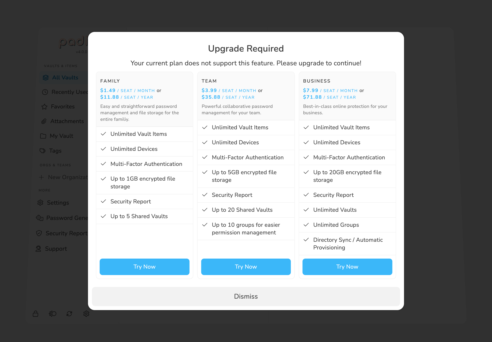
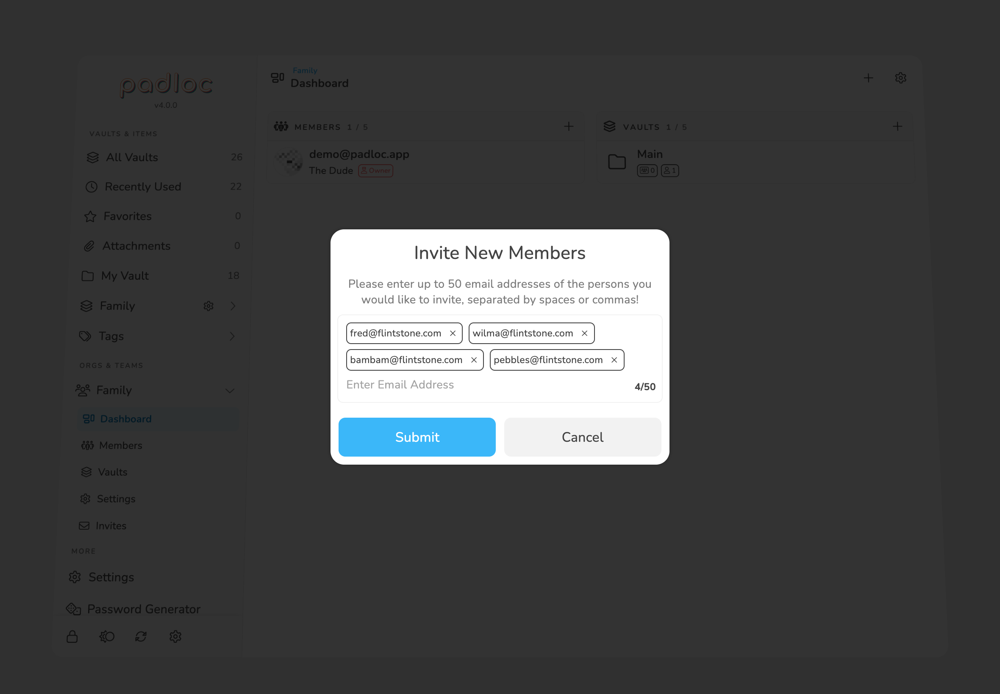
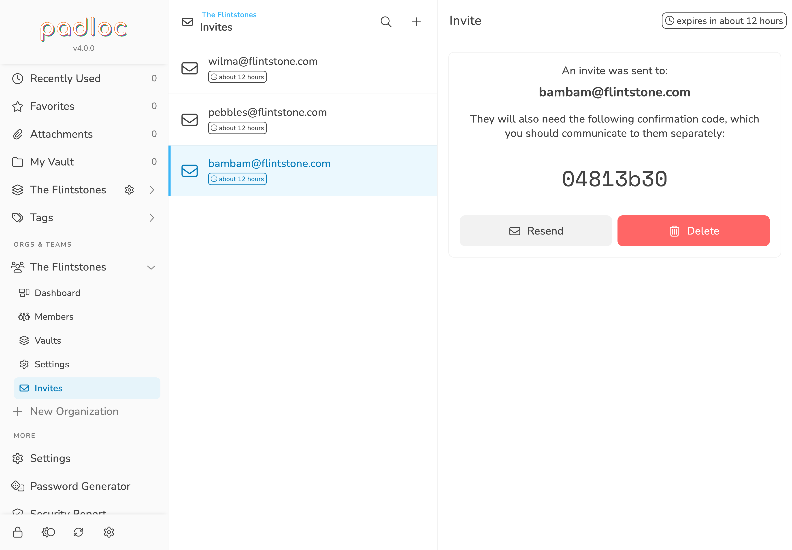
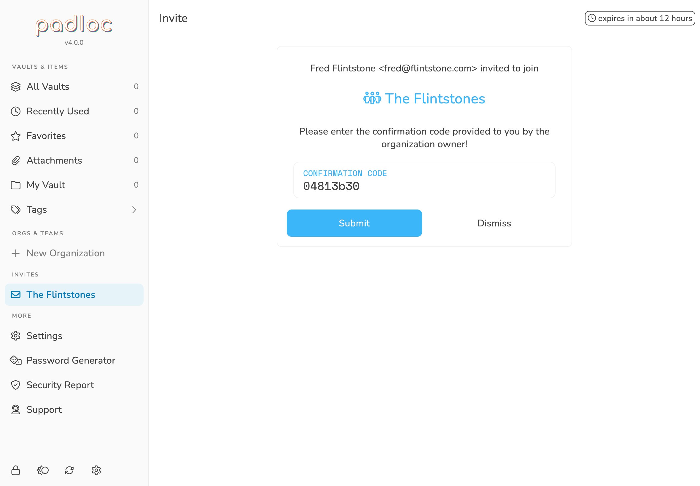
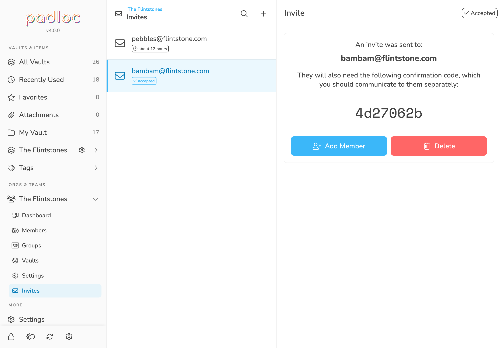
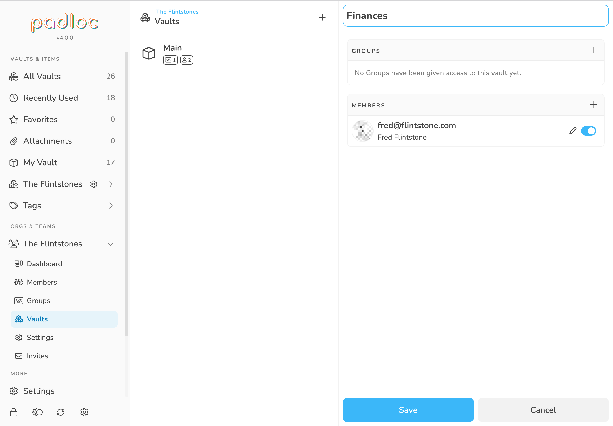
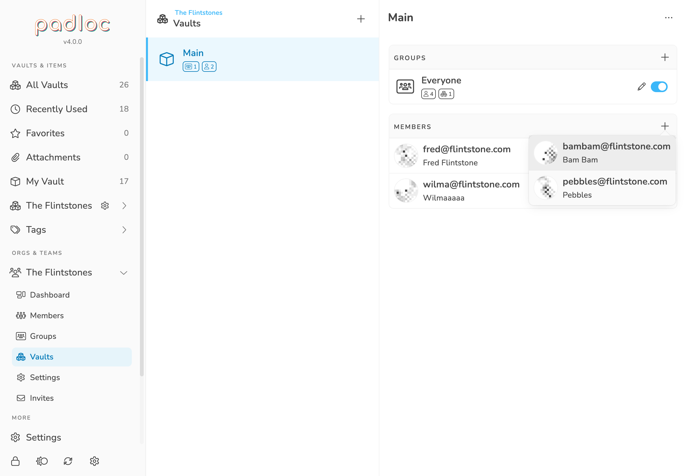

Organizations are a great way to organize, manage and share data between Padloc
users. Use cases range from simple family accounts to teams, companies or any
other kind of institution or group that has the need store store and share
sensitive information between multiple people. Using organizations, you have
fine-grained control of who can access, edit and share certain information.
Padloc achieves this without requiring you to explicitly trust our servers, your
network provider or anyone who might be listening in on the connection. If you
want to learn more about how we make sure that your data is only visible to the
people it is meant for, check out our
[security white-paper](../../docs/security).

## Creating an organization

To create an organization, click the <i class="plus"></i>
New Organization button in the **main menu**. You'll be given the option
between the **Family**, **Team** and **Business** plans, which vary in a few key
aspects. For demonstration purposes we'll be choosing the **Team** plan. Pick
whatever plans seems right for you and don't worry, all plans have a 30 day
trial period so you can give it a test ride without having to pay anything.

<figure>
    
    <figcaption>Choose whatever plan seems right for you. Don't worry, they're all free for the first 30 days!</figcaption>
</figure>

Upon successfully upgrading to the **Family**, **Team** or **Business** plan,
Padloc will automatically create the organization for you, which should show up
in the main menu as "Family", "My Team" or "My Business", depending on which
plan you chose. If it doesn't show up right away, try clicking the
<i class="refresh"></i> button at the bottom of the
main menu.

> <i class="info-circle"></i> Don't worry, you're not stuck with the default
> organization name! You can change it anytime in the
> [organization settings](#renaming-your-organization)!

## Members

Organization Members are verified Padloc users that can be assigned to
[Groups](#groups) and given access to shared [Vaults](#vaults). You can view and
manage your organization's members in the **Members Page**, which you can get to
by clicking on the organization name in the main menu (right below
"Organizations"), then selecting
<i class="people-group"></i> Members.

### Roles

There are three different roles members can fill in an organization.

-   The **owner** is the user who created the organization and is the only one
    who can add, suspend and un-suspend members, appoint admins and change the
    organization's settings.
-   **Admins** can create groups and vaults and assign read and write
    permissions for vaults.
-   **Regular members** don't have any permissions other than the read and write
    permissions assigned to them for specific vaults either directly or through
    groups.

### Adding New Members

Adding a new member is a multi-step process establishing a cryptographic
handshake that will allow both the new member and the organization to verify
each others identities and safely encrypt data in a way that will allow all all
authorized parties to access it simultaneously.

> **<i class="info-circle"></i> Note**: You have to be the organization's owner
> to add or remove members.

#### Step 1: Send Invite

Before you can add a person to your organization, you have to send them an
invite first. The invite will be sent by email, and accepting it will require a
confirmation code (more about that below).

To send an invite to join your organization, first go the the
<i class="people-group"></i> Members page, then
click on the <i class="plus"></i> button in the top.

You'll be presented with a dialog where you can now enter the email address of
the person you'd like to invite. To invite multiple people at once, type in all
their email address, separated by a comma or space.

<figure>
    
    <figcaption>Invite new members by entering their email address and clicking Submit.</figcaption>
</figure>

Once you've created an invite, it will show up under
<i class="envelope"></i> Invites. Select the invite
to view the invite status and, most importantly, the **confirmation code**. Each
invite comes with unique confirmation code that the invitee will have to enter
correctly in order to accept the invite, so make sure to inform them of their
code via text message, phone call or in person.

<blockquote class="orange">
    <i class="info-circle"></i> As a security precaution, <strong>invites are only valid for 12 hours</strong> so
    make sure you complete the process before then.
</blockquote>

<figure>
    
    <figcaption>The confirmation code is required to accept the invite and needs to be communicated separately.</figcaption>
</figure>

#### Step 2: Accept The Invite

The recipient of the invite will receive an email asking them to accept the
invite. Following the embedded link will bring up a confirmation dialog. (If
they don't have a Padloc account yet, they'll have to go through the
[signup process](../create_account/) first).

<figure>
    
    <figcaption>Invitees will have to enter a confirmation code that you'll have to communicate to the directly.</figcaption>
</figure>

At this point they will have to enter a confirmation code, which is the same
alphanumeric code displayed on your end. As mentioned before, organizations and
shared vaults are designed in a way that do not require explicitly trusting
whoever is hosting the server (in this case, us). **The confirmation code plays
an important part in this as it is never send to the server in plain text and is
only visible to the organization owner, who has to communicate this code to the
invitee directly.** We recommend using a channel other than email, like a text
message, in person or by phone, but how you do this is up to you.

#### Step 3: Confirm Membership

Once they have entered the correct code and accepted the invite, you'll be
notified by email. All that is left to do then is to confirm their membership!
In order to do that, go to the <i class="envelope"></i>
Invites page, then click <i class="user-plus"></i>
Add Member.

<figure>
    
    <figcaption>
        Once the invitee has entered the correct code and accepted the invite,
        all that is left to do then is to confirm their membership!
    </figcaption>
</figure>

#### Step 4: Adjust Role and Permissions

You've successfully added a new member to your organization, but they won't have
access to any vaults yet. You can now add them to [Groups](#groups), give them
permissions to access certain [Vaults](#shared-vaults) or adjust their
[role](#member-roles).

### Deleting Members

To delete an organization member, select them from the list in the
<i class="people-group"></i> Members page, then
click the <i class="ellipsis-h"></i> button in the
top right and select <i class="trash"></i> Delete.

When a Padloc user is removed from an organization, they automatically lose
access to all of the organization's vaults.

<blockquote class="orange">
    <i class="exclamation-triangle"></i> Even after removing access to a vault, the
    data may still be stored offline on on some of their devices and there is now
    way to be sure they haven't copied some of the data in
    some other way, so may want to take measures to account for this, like changing
    any passwords they had access to.
</blockquote>

### Suspending and Un-suspending Members

Suspended members retain their assigned permissions and group memberships but
can no longer utilize their permissions, meaning they will not receive any
updates to vault data or be able to make any changes themselves.

You can **suspend** an organization member by selecting them from the list in
the <i class="people-group"></i> Members page, then
clicking the <i class="ellipsis-h"></i> button in
the top right and selecting <i class="ban"></i>
Suspend.

To **un-suspend** a member, simply select
<i class="user-check"></i> Unsuspend from the same
menu. You will then have to reconfirm their membership by undergoing the same
process you did when a [adding them](#adding-new-members).

> <i class="info-circle"></i> Members will automatically be suspended if they
> recover their account after losing their master password or when the
> organization's cryptographic keys are rotated, in which case all organization
> members will be suspended except the organization owner.

### Make Someone an Admin

To **make someone an admin**, first select an organization member by selecting
them from the list in the <i class="people-group"></i> Members page, then click the
<i
class="ellipsis-h"></i> button in the top right and select
<i class="ban"></i> Make Admin.

To **remove someones admin privileges**, simply select
<i class="user-times"></i> Remove Member from the
same menu.

### Transfer Ownership

To **transfer ownership to a another user**, first select an organization member
by selecting them from the list in the <i class="people-group"></i> Members page, then click the
<i
class="ellipsis-h"></i> button in the top right and select
<i class="user-crown"></i> Make Owner. Your own role
will be changed to **Admin**.

<blockquote class="orange">
    <strong><i class="info-circle"></i> Please note:</strong> Transferring
    organization ownership does <strong>not</strong> transfer any billing information. Instead,
    the previous owners' plan will automatically downgraded to <strong>Premium</strong> and the
    organization will be frozen until the new owner upgrades to the appropriate
    plan.
</blockquote>

## Vaults

As mentioned in the [previous article](../vaults/), **Vaults are like secure
folders that can hold a number of data entries, or "Vault Items"**. However
unlike your personal Vault, an organization's Vaults are designed to share
information between multiple Padloc users!

By default every organization comes with a **Main** vault. This vault is merely
created for your convenience and doesn't serve any special purpose, but it may
be a good place to store data all or most of your organization's members should
have access to. You can add more vaults to organize your data into more specific
segments for more fine-grained control over who has access to what data. For
example you could have a vault that contains all your finance and accounting
related data, one with all your social media accounts and so on.

You can view and manage your organization's vaults in the **Vaults Page**, which
you can get to by clicking on the organization name in the main menu (right
below "Organizations"), then selecting
<i class="cubes"></i> Vaults.

### Creating Vaults

To create a new vault, navigate to the
<i class="cubes"></i> Vaults page and click
<i class="plus"></i> button on the top.

<figure>
    
    <figcaption>When you create a new Vault, you can choose a vault name and define permissions.</figcaption>
</figure>

Enter the name of your new vault in the input on the top. You can also define
who can read and/or edit vault data by assigning permissions to organization
members directly or indirectly through groups (more about this in the
[Managing Access](#managing-access) section). To add the vault to your
organization, click Save.

### Editing Vaults

You can edit an existing Vault by selecting it from the
<i class="cubes"></i> Vaults page and simply making
the desired changes. Don't forget to hit
Save to save your changes!

### Deleting Vaults

To delete a Vault, go to the <i class="cubes"></i>
Vaults page and select the desired Vault from the list. Then click the
<i class="ellipsis-h"></i> button and select
<i class="ellipsis-h"></i> Delete. You'll have to
confirm you choice by entering the word "DELETE" and hitting
Delete.

<blockquote class="orange">
    <strong><i class="exclamation-triangle"></i> Warning:</strong> Deleting
    Vaults is permanent, and destroys all data saved within.
</blockquote>

### Managing Access

Organizations have a simple yet powerful permissions system that allows you to
define who can read, edit and manage vaults. Read and write permissions can be
assigned to members directly or indirectly through groups.

#### Assigning Individual Members

One way to grant a member access to a given vault is to assign them
individually. To do this, first select the desired vault from the
<i class="cubes"></i> Vaults page, then click the
<i class="plus"></i> button in the top right corner
of the box labeled "Members". After you've added them, you can also decide
whether you want to give them write access by toggling the
<i class="pencil-alt"></i> <i class="toggle-on"></i>
button on (write access) or off (read-only).

To remove a member's access to a Vault, move your mouse over them (or tap on
them if you're on mobile) and click the
<i class="times"></i> button.

Don't forget to hit Save to save your
changes!

<figure>
    
    <figcaption>
        To assign a new member to a Vault, click the <i class="plus"></i> button and select the desired member from the list.
    </figcaption>
</figure>

#### Assigning Groups

Assigning Vault access to each organization member individually might work well
for small organizations, but for organizations with many members,
[Groups](#groups) are a more efficient way to manage permissions.

Adding Groups to a Vault works exactly the same as
[assigning individual members](#assigning-individual-members). Simply click the
<i class="plus"></i> button in the top right corner
of the box labeled "Groups". Same as with individual members, Groups can have
write or read-only access, which you can determine by toggling the
<i class="pencil-alt"></i> <i class="toggle-on"></i>
button on (write access) or off (read-only).

To remove a Groups's access to a Vault, move your mouse over it (or tap on it if
you're on mobile) and click the
<i class="times"></i> button.

Don't forget to hit Save to save your
changes!

## Groups

Groups are a great way to organize your company or team into certain segments
based on their job description, level of clearance or any other criteria you may
come up with. For example, your groups could reflect the departments in your
company, like **Management**, **Accounting**, **Engineering** etc, but how you
use them is ultimately up to you.

> **<i class="info-circle"></i> Note:** This feature is only available in the
> **Team** and **Business** plans.

Just like regular organization members, groups can be assigned read and write
permissions to a certain subset of the organization's vaults, which are then
transferred to all of the members within the group. Vault permissions are
additive, which means that an organization member has the read or write
permission to a certain vault if they are part of **any** group that has that
permission **or** that permission is assigned to them directly (see
[Managing Access](#managing-access)).

By default, every organization comes with the **Everyone** group. This group is
merely created for your convenience and doesn't serve any special purpose. Feel
free to repurpose or [delete](#deleting-groups) it.

You can view and manage your organization's Groups in the **Groups Page**, which
you can get to by clicking on the organization name in the main menu (right
below "Organizations"), then selecting
<i class="users-rectangle"></i> Groups.

### Creating Groups

To create a new Group, go to the
<i class="users-rectangle"></i> Groups page and
click the <i class="plus"></i> button on the top.
now you can enter the group's name select the which organization members should
be part of this group.

Here you can also define which Vaults this group should have access to. This
works exactly the same way as described [here](#assigning-groups), only in
reverse.

Click Save to create the new Group.

### Editing Groups

You can edit an existing Group by selecting it from the
<i class="users-rectangle"></i> Groups page and
simply making the desired changes. Don't forget to hit
Save to save your changes!

### Deleting Groups

To delete a Group, go to the
<i class="users-rectangle"></i> Groups page and
select the desired Group from the list. Then click the
<i class="ellipsis-h"></i> button and select
<i class="ellipsis-h"></i> Delete.

### Duplicating Groups

Sometimes you may want to create a new Group that is similar to an existing
Group, but with only a few changes. In this case it might be quicker to
**duplicate** a Group instead of creating a completely new one.

To duplicate a Group, go to the
<i class="users-rectangle"></i> Groups page and
select the desired Group from the list. Then click the
<i class="ellipsis-h"></i> button and select
<i class="clone"></i> Duplicate. This will create a
new Group with the same assigned Members and Vaults. You'll be taken straight to
the duplicate group where you can now make your adjustments.

## Renaming Your Organization

To change your organization's name, navigate to the organization's
<i class="gear"></i>Settings page and click the
button labeled Change Organization Name. Then simply
enter the new name and click Save.

## Rotating Cryptographic Keys

When you create an organization, Padloc will generate a set of cryptographic
keys that are used for signing and verifying the identity of its members. These
keys are protected by a strong encryption scheme and only accessible to the
organization owner (this is why only the owner can invite and add members).

To ensure the integrity of the cryptographic contracts that protect all
communication between organization members, it is important that these keys
remain secret to anyone but the organization owner. Should you as the
organization owner have any reason to believe that your Padloc account may have
been compromised in any way, you can generate a new set of keys via the
Rotate Cryptographic Keys option in the
organization's <i class="Settings"></i> Settings
page.

After rotating your organization's cryptographic keys, all the organization's
members except the owner will be suspended and will have to be reconfirmed (see
[Suspending and Un-suspending Members](#suspending-and-un-suspending-members)).

## Deleting An Organization

> **<i class="info-round"></i> Note:** Deleting an organization will **not**
> delete the accounts of its members - they will merely loose access to all data
> owned by it. The private vaults of the organization's members are also not
> affected.

To delete an organization, click the button labeled
Delete Organization at the very
bottom of the settings tab, then type out the word "DELETE" to confirm your
choice.

<blockquote class="red">
    <strong><i class="exclamation-triangle"></i> Warning:</strong> Deleting an
    organization will cancel any active subscriptions and permanently
    erase all the organization's data from Padloc, including all shared vaults owned
    by it. **This action is not reversible!**
</blockquote>
