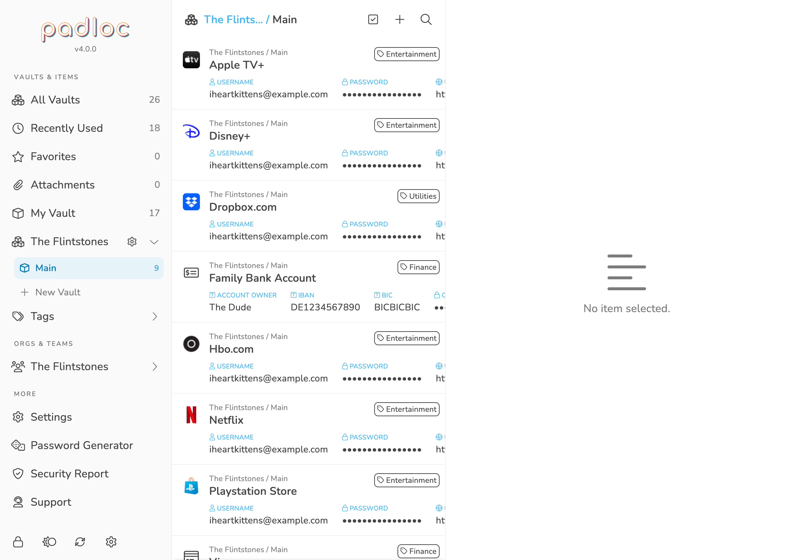
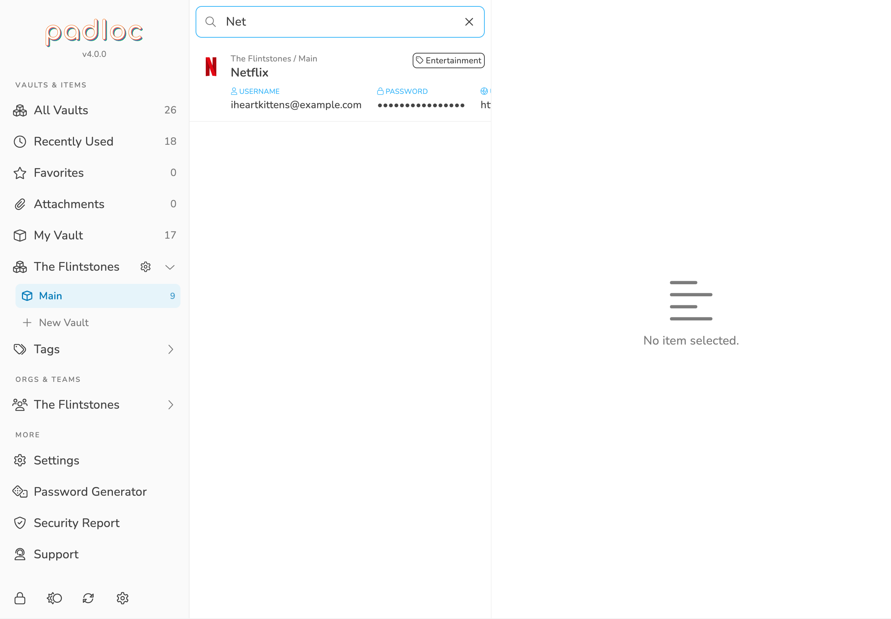

Searching and filtering is is easily one of the most overlooked aspects of a
password manager. Over time a lot of data will be accumulating in your vaults
and being able to quickly and easily find the data you need at any given moment
is essential for a productive workflow and will save you a lot of time in the
long run. Luckily this is one of the areas where Padloc really shines! Here are
a couple of ways to quickly find what you need.

## Filtering By Vaults

By default, Padloc displays all of your items in one list. If you want to see
only the items in a specific vault, simply select it from the main menu.

> **<i class="info-circle"></i> Tip:** On smaller screen sizes the main menu
> might not be visible by default. In that case you can bring up the main menu
> by clicking the header in the list view!

To learn more about how to create and manage shared vaults, check out the
[Organizations & Shared Vaults](../orgs) section of the manual!

<figure>
    
    <figcaption>You can filter items by vaults, tags, favorites, or attachments.</figcaption>
</figure>

## Filtering By Tags

[Tags](../vaults#tags) are a simple but powerful way to organize items by type,
areas of use or any other criteria you can come up with. They also allow you to
quickly discover items you have previously tagged! To list all items with a
given tag, simply select it from the main menu under
<i class="tags"></i> Tags.

You can learn more about how to create and manage tags in the
[Vaults & Vault Items](../vaults#tags) section of the manual!

## Favorites

Your favorites are vault items that you use a lot or are especially important to
you form some other reason. [favorites](../vaults#favorites). To list all you
favorite vault items simply select the <i class="star"></i>
Favorites option from the main menu. Want to know how to add a vault item
to your favorites? Check out the [Vaults & Vault Items](../vaults#favorites)
section of the manual!

## Recently Used Items

For most users, it is non uncommon to only have a handful of password that are
actually needed day-to-day. Wouldn't it be great to have a convenient way of
listing these items with a single click? Why yes of course, and Padloc let's you
do just that. To list all you favorite vault items simply select the
<i class="clock"></i> Recently Used option from the
main menu, or pick it from the dropdown in the header of the list view.

## Attachments

Need to find that one document you stored in Padloc a while ago but forgot how
you named it? Listing only the vault items that have attachments will make the
search much easier! To do this, simply select the
<i class="paperclip"></i> Attachments option from
the main menu or pick it from the dropdown in the header of the list view.

To learn more about how to attach files to vault items, check out the
[Vaults & Vault Items](../vaults#attachments) section of the manual!

## Searching

Last but not least, the free search is probably the simplest and most powerful
tool to quickly find what you need. Simply click the
<i class="search"></i> button and type away! Usually
a couple of key strokes will narrow down the list enough to spot what you're
looking for!

> **<i class="info-circle"></i>** For simplicity's sake, the full search always
> searches **all** your items, regardless of whether you had a filter applied
> when you started searching. Canceling the search will bring you right back to
> where you started though.

<figure>
    
    <figcaption>Searching is usually the fastest way to find what you need.</figcaption>
</figure>

> **<i class="lightbulb-on"></i> Protip**: For those who like keyboard
> shortcuts: You can also use ⌘ +
> F to jump straight into the search input! Press
> Esc to cancel the search.
