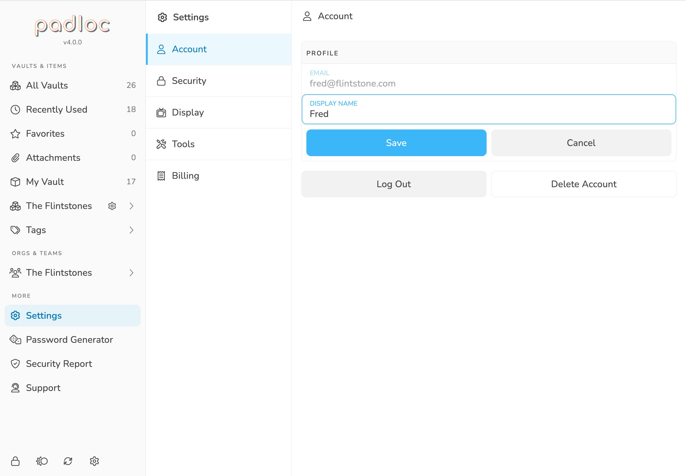
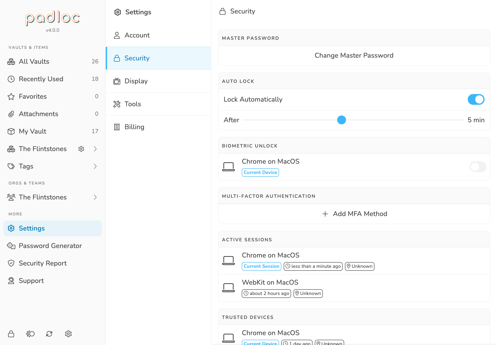
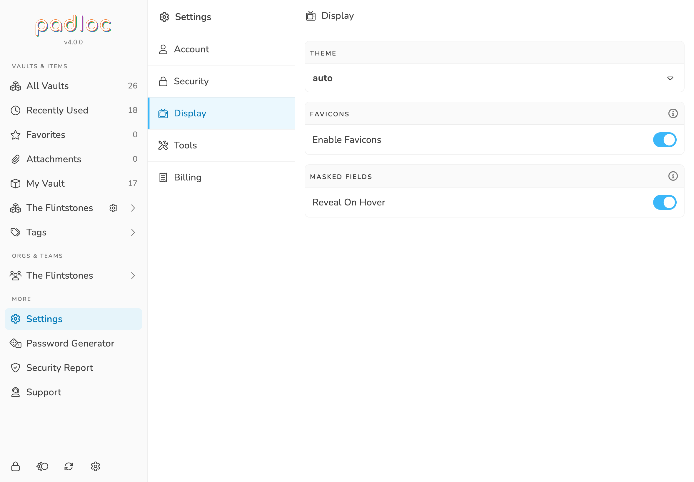
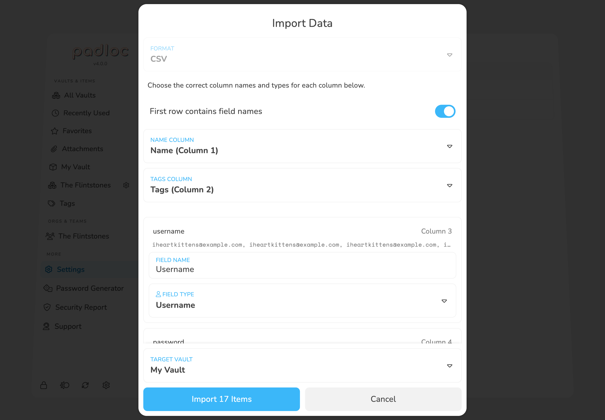
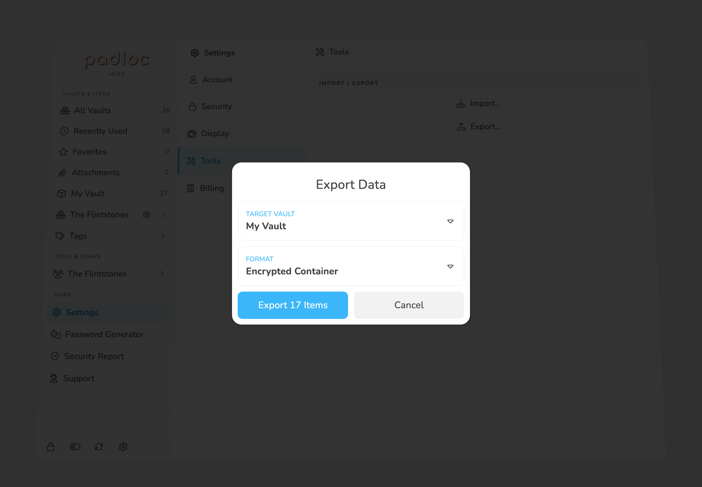

The **Settings** screen contains options for managing your account, your
subscription and billing info and various other things.

## <i class="user"></i> Account

To get to the account settings, select <i class="cog"></i>
Settings the main menu, then <i class="user"></i>
Account. Here you can
[update your display name](#change-your-display-name), [log out](#log-out) of
your account or [delete](#deleting-your-account) it altogether.

### Change Your Display Name

Your display name is what other Padloc users will see next to your email address
if your are a member of any [organizations](../orgs). To change your display
name, simply enter the updated name, then click
Save to confirm the change.

<figure>
    
    <figcaption>You can change your display name in the account settings.</figcaption>
</figure>

### Log Out

To log out of your Padloc account, go to the [account settings](#account), then
click the button labeled Log Out. This will delete
all your locally stored data and bring you back to the login screen.

### Deleting Your Account

<blockquote class="red">
    <strong><i class="exclamation-triangle"></i> Important:</strong> Deleting your
    account will cancel any active subscriptions and permanently erase all your data
    from Padloc, <strong>including all organizations owned by you and associated data</strong>.
    This action is not reversible!
</blockquote>

To delete your Padloc account, go to the [account settings](#account), then
click the button labeled Delete Account. You'll have
to enter your master password, then confirm your choice by typing out the word
"DELETE" and hitting
Delete.

## <i class="lock"></i> Security

To get to the security settings, select <i class="cog"></i>
Settings the main menu, then <i class="lock"></i>
Security. Here you can
[change your master password](#changing-your-master-password), manage sessions
and MFA methods, and more.

<figure>
    
    <figcaption>
        In the security settings you can change your master password,
        manage sessions, MFA methods, and more.
    </figcaption>
</figure>

### Changing Your Master Password

To change your master password, go to the [security settings](#security), then
click the button labeled Change Master Password.
After entering your current password, enter your new password and confirm it by
retyping it in the input below. To confirm the change, click
OK.

### Auto Lock

The **Auto Lock** feature allows you to configure whether you want to Padloc to
automatically lock after a certain period of inactivity (no interaction with the
app). To enable or disable the feature, simply toggle the button labeled
Lock Automatically <i class="toggle-on"></i>. To
adjust the duration after which the app should auto-lock, drag the slider right
below the button.

You can read more about
[the security about locking and unlocking here](/manual/locking-and-unlocking/).

## <i class="tv-retro"></i> Display

The display settings allow you to make various adjustments to Padloc's
appearance and user experience. To get to the security settings, select
<i class="cog"></i> Settings the main menu, then
<i class="tv-retro"></i> Display.

<figure>
    
    <figcaption>
        The display settings allow you to make various adjustments to Padloc's
        appearance and user experience.
</figcaption>
</figure>

### Theme

The cool kids are all about dark mode these days, and Padloc now has a dark
theme as well 🥷! To change the current theme, go to the
[display settings](#display), then select the desired theme from the dropdown in
the box labeled "Theme". Currently you can choose between 3 options: **light**
and **dark**, which are self-explanatory, and **auto**, the default. Setting the
theme to **auto** will select the preferred theme based on the settings of your
browser and operating system.

> **<i class="lightbulb-on"></i> Did you know?** You can also switch between
> themes by clicking the <i class="eclipse"></i> on
> the bottom of the main menu! (And a little bird told me that you can do the
> same on this very page 😎)

### Favicons

Padloc can use the URLs fields stored in your vault items to find and display
website icons for them. You can disable this behavior by deselecting the button
labeled Enable Favicons <i class="toggle-on"></i>

### Reveal Masked Fields On Hover

If Reveal On Hover <i class="toggle-on"></i> is
enabled, masked fields such as passwords or credit card numbers will be unmasked
when you move your mouse over them. Disable this option if you would rather use
an explicit button.

## <i class="screwdriver-wrench"></i> Tools

### Importing Data

Padloc provides an easy way to import data from other applications. Supported
formats are:

- **Comma Separated Values
  ([CSV](https://en.wikipedia.org/wiki/Comma-separated_values))** - Many
  applications support exporting data in this format, and Padloc provides a
  powerful import assistant that should allow you to import data from pretty
  much anywhere that allows exporting to CSV.

- **Encrypted Padloc Export** - Lastly, Padloc has its own, encrypted export
  format which naturally is supported and recognized automatically. Encrypted
  Padloc Exports are protected by a password which you'll have to provide during
  the import process.

Here is how to import data into Padloc:

1. Go to <i class="cog"></i> Settings /
   <i class="screwdriver-wrench"></i> Tools
2. Click <i class="file-import"></i> Import...
3. Select the file you want to import.
4. Padloc should automatically recognize the file as a CSV file and select the
   appropriate format. If it is an **Encrypted Padloc Export**, you'll now be
   asked for a password. If you're importing a **CSV file** you can now
   configure the [CSV import options](#csv-import-options).
5. Select the Target Vault
   <i class="caret-down"></i> you want to import the data into.
6. Click Import [x] Items to complete
   the process.

### CSV Import Options

[CSV files](https://en.wikipedia.org/wiki/Comma-separated_values) are a fairly
open format, and their structure can vary significantly depending on where you
exported them from. In order to properly process the data in your CSV file,
Padloc needs some additional info from you.

<figure>
    
    <figcaption>Padloc's powerful CSV import allows you to import data from all kinds of sources.</figcaption>
</figure>

#### 1. Does the first column contain field names?

The first line in a CSV file is commonly used to label the columns in the file.
If present, this information is helpful for Padloc to determine the
[name and tags columns](#picking-the-name-and-tags-columns), as well as properly
naming fields. If the first line in your CSV file does **not** contain field
names but actual data, you can disable this option via the
First row contains field names
<i class="toggle-on"></i> button. When in doubt, it's usually best to
leave this option on.

#### 2. Pick the name and tags columns

In addition to regular fields, there are two special properties that are treated
specially. Padloc will try to determine the correct columns for these
automatically, but you still have the option to adjust this manually.

The **name column** is where the item name is stored. This is usually the first
column. This is the only column that is required for a successful import.

The **tags column** determines which column should be used for
[tags](http://localhost:9090/manual/vaults/#tags). This column should contain a
comma-separated list of tag names. If the application your importing from
doesn't not have a suitable equivalent for Padloc's tags, you can set this to
**None**.

> **<i class="info-circle"></i> Note:** Other applications may have a similar
> concept to tags, but under a different name like "categories" or "folders".
> These may still be usable as tags, as long as they're formatted as a
> comma-separated list.

#### 3. Adjust field names and types

Based on the structure of the CSV file and the information you provided in the
previous steps, Padloc will detect and extract all additional columns and
interpret them as fields for your vault items. Again, Padloc will do it's best
to automatically determine the correct name and type for each field, but we
recommend still checking these so you can make adjustments in case we got
something wrong.

### Exporting Data

Here is how you export your data from Padloc:

1. Go to <i class="cog"></i> Settings /
   <i class="screwdriver-wrench"></i> Tools
2. Click <i class="file-export"></i> Export...
3. Under Target Vault <i class="caret-down"></i>,
   choose the vault you'd like to export. You can also choose **All Vaults**,
   which will create export files for all vaults at once and bundle them in a
   `.zip` file before downloading.
4. Under Format <i class="caret-down"></i>, select
   **Encrypted Container** or **CSV**.
5. The Export [x] Items button at the
   bottom of the dialog will indicate how many items will be exported. Click it
   to continue.
6. If you chose the **Encrypted Container** option, you'll know have to enter a
   password to protect your data. This does not have to be the same as your
   master password but should be sufficiently strong. The app will warn you if
   you choose a password that is considered too weak.

<blockquote class="orange">
    <strong><i class="exclamation-triangle"></i> Warning:</strong> Exporting to CSV
    format will save your data without encryption of any kind which means it can be
    read by anyone. We strongly recommend selecting **Encrypted Container** instead.
</blockquote>

<figure>
    
    <figcaption>The export dialog will let you choose the vault you'd like to export.</figcaption>
</figure>
