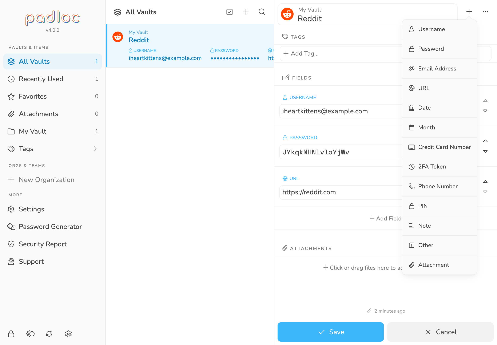

After [creating your Padloc account](../create_account/) and opening Padloc, the
first thing you'll be greeted with is the message **_You don't have any [vault]
items yet._**

<figure>
    
    <figcaption>Looks pretty empty, huh? Don't worry, you'll fill it up in no time!"</figcaption>
</figure>

This is not surprising, since we haven't done anything yet! But what are vault
items, you might ask, and what do I do with them?

**Vault Items (or simply "Items") are individual data entries that can hold all
kinds of information, from secret notes and WIFI passwords, to credit card
numbers, bank details and even encrypted files!** Most of these items will
likely contain usernames and passwords for websites and apps (it's called a
"password manager" after all), but Padloc gives you absolute freedom in what
kind of information you'd like to store in your Vault Items (more about that
below).

As you might have guessed, Vaults are where your Vault Items are stored. You can
imagine them as secure folders that are protected by your master password and
can hold any number of Items. You'll start off with a single Vault called "My
Vault". This vault is meant only for you and is where you'll to store all your
personal data. For a lot of users, one Vault will be more than enough, as it can
hold an arbitrary number or items and there are plenty of ways to organize and
discover items within it (you can read more about that in the
[Searching & Filtering](../search) section). If you want to learn about how to
create new Vaults and share them with other Padloc users, check out
[Organizations & Shared Vaults](../orgs).

> **<i class="lock"></i> Vaults are protected by strong, state of the art
> encryption** and can only accessed by you (and other Padloc users you
> explicitly give access). Not even we can read what's inside, even if we wanted
> to!

## Creating Vault Items

Ok, enough theory. Now that we know what Vaults and Vault Items are, let's go
ahead and **create your first Vault Item**! To get started, click on the little
<i class="plus"></i> icon on the top!

<figure>
    
    <figcaption>You can choose between a number of predefined item types.</figcaption>
</figure>

Look at all those options! We didn't lie when we said that Padloc can store all
kinds of information. In fact, you have absolute freedom in deciding what kind
of data your vault items should hold. The options presented here are merely
predefined templates provided for your convenience and you can always add and
remove data as the mood strikes you (more about how that works in a moment).
Notice that you can also choose which Vault to save the item to. We only have
one Vault at this point so that one will have to do (to learn how to create new
Vaults and share them with others, check out
[Organizations & Shared Vaults](../orgs)). Let's select **Website / App** and
see where that get's us. Click Create to
continue.

<figure>
    
    <figcaption>Picking "Website / App" gives you three predefined fields.</figcaption>
</figure>

Now we're getting somewhere! Since we chose the **Website / App** template,
Padloc has added the fields **Username**, **Password** and **URL** for us.
Again, these are just the default fields for this template. You can add and
remove fields and edit field names at any time. For now, let's just fill this
out and click <i class="check"></i>
Save. Don't forget to add an item name by filling out the field in the
top!

> <i class="info-circle"></i> Nobody likes typing, so whenever you click into a
> field, Padloc will suggest values for you based on the field type. For
> example, when you click into the password field, Padloc will automatically
> generate a number of random passwords for you! Simply click on one of the
> suggestions to apply them.

<figure>
    
    <figcaption>And there it is - your first Vault Item! <i class="face-party"></i></figcaption>
</figure>

And there it is - your first Vault Item! But if you think we're done here you
couldn't be more wrong! We've only scratched the surface...

## Editing Vault Items

To edit an item, simply select it from the list and then click the little
<i class="pencil-alt"></i> bottom in the top right.
The item will be opened in "edit mode" and you can now make all the desired
changes.

<!-- <figure>
    
    <figcaption>Wait, have we been here before?</figcaption>
</figure> -->

Once you're done, simply hit the
<i class="check"></i> Save button again
to save your changes. Or you can always hit
<i class="times"></i> Cancel to discard your changes
of course!

### Adding Fields

As mentioned before, Padloc gives you absolute control over what kind of
information you want to store in your items. A username and password and maybe a
url might be sufficient for most items, but you never know what other kind of
information you may want to store alongside them. For example, a website may ask
you to enter a security question and answer, or maybe you simply want to add
some notes and comments.

Adding new fields to an Item is easy - in [edit mode](#editing-vault-items),
click the <i class="plus"></i> button in the top
right corner. You'll be presented with a few different field types to choose
from. Simply pick the one that fits the kind of data you want to store and then
fill out the field. Don't forget to hit
<i class="check"></i> Save to save your
changes!

<figure>
    
    <figcaption>Hit the <i class="plus"></i> button in the top right corner to add a new field.</figcaption>
</figure>

### Deleting Fields

To delete a field, first enter [edit mode](#editing-vault-items) and then click
the the <i class="trash"></i> button next to the
field you want to remove. Confirm the action by clicking
Remove, and then save your changes
using the <i class="check"></i> Save
button.

### Reordering Fields

Apart from adding, editing and removing fields, you can also **reorder** them by
using the <i class="caret-down"></i> and
<i class="caret-up"></i> buttons on the right side
when id [edit mode](#editing-vault-items). Don't forget to hit
<i class="check"></i> Save to save your
changes!

## Generating Passwords

Now that Padloc is remembering all your passwords for you, there is no more
excuse to use pet names or birthdays for them! **A good password should be
completely random, sufficiently long and extremely hard to guess.** Coming up
with truly random passwords is hard though, so you'll likely need some help.
Luckily, Padloc has a build in password generator! Let's see how that works -
see the little <i class="dice"></i> icon next to the
password field? Clicking it will bring up the **password generator**.

<figure>
    
    <figcaption>Hit the <i class="dice"></i> button next to the password field to open the password generator.</figcaption>
</figure>

You can choose between a random passphrase similar to the one suggested to you
during the
[signup process](../create_account#step-3-choose-your-master-password") or a
string of random characters. A passphrase will be easier to copy manually in
cases where you don't have the option to copy & paste but some websites have
very specific password requirements you might have to go with the **random
string** option where you can choose what kind of characters you be used in the
password. If for some reason the generated password doesn't work for you you can
regenerate it by clicking <i class="refresh"></i>
Regenerate.

Once you're happy with the result, click
Use and the generated password will be
automatically copied into the appropriate field. Or you choose
Discard and leave your password as-is.

> **<i class="lightbulb-on"></i> Did you know?** If you click into an empty
> password field, Padloc will automatically generate a few random password
> suggestions for you, which will show up right underneath your cursor. Simply
> click one of them to use it!

## Deleting Items

To delete an item, first enter [edit mode](#editing-vault-items), then click the
<i class="ellipsis-h"></i> button in the top right
corner. This will open a popup menu with a couple of options. Select
<i class="trash"></i> Delete Item and then
Delete to confirm.

<blockquote class="red">
    <i class="warning-triangle"></i> <strong>Warning</strong>: Deleting Items is permanent! So
    please check twice before deleting anything.
</blockquote>

### Deleting Multiple Items

Sometimes you just need to clean house, and deleting one Item at a time simply
won't cut it. To delete multiple items at once, start by clicking the
<i class="square-check"></i> button in the header on
the top of the list view. Now select any items you want to delete by clicking on
them and then click the <i class="trash"></i> button
in the top right corner. You'll have to confirm you choice by clicking the
Delete [x] Items button.

<figure>
    
    <figcaption>You can delete multiple items at once using the <i class="square-check"></i> in the list view.</figcaption>
</figure>

## Moving Items Between Vaults

Once you have more than one vault, you may occasionally want to move an item
from one vault to a different one. To do this, simply enter
[edit mode](#editing-vault-items) and select the <i
class="share"></i> Move option from the
<i class="ellipsis-h"></i> menu.

> **<i class="lightbulb-on"></i> Tip:** Same as with
> [deleting multiple items](#deleting-multiple-items), you can move multiple
> items at once via the multi-select mode in the list view.

## Tags

Tags are a simple but powerful way to organize items by type, areas of use or
any other criteria you can come up with. This not only provides additional
context but also makes item more discoverable (even across multiple vaults). To
add a tag to an item, enter [edit mode](#editing-vault-items) and click on the
<i class="plus"></i> Add Tag input and start
typing. Hit enter or click on one of the suggested tags to add it.

<figure>
    
    <figcaption>Tags are a simple but powerful way to organize your items.</figcaption>
</figure>

You can add as many tags to an item as you want. Once a tag has been added to
any item, it will show up in the menu under "Tags". For more info on how to
filter items by tags an other criteria, check out the
[Searching & Filtering](../search) section of the manual.

## Favorites

To add an item to your favorites, simply click the
<i class="star"></i> button next to the item name
(you don't have to go into edit mode for this). Once favorited, an item will
show up under **Favorites** in the main menu and will be highlighted in the list
view. To remove an item from your favorites, simply click the
<i class="star"></i> button again.

## Expiration Period

Many services and companies require a password to be changed in regular
intervals. But even if it's not a requirement, rotating your passwords regularly
is generally not a bad idea! By adding an **expiration period** to your vault
item, you can let Padloc remind you when it's time to update it!

To **add an expiration period**, simply click
<i class="plus"></i> Add Expiration inside the
section titled <strong><i class="hourglass-clock"></i> Expiration</strong>. You
can then enter the number of days after which the item should expire. Click
Save to complete the process.

Once you've added an expiration period, Padloc will monitor the number of days
since the item has been updated. If the defined number of days is exceeded, your
item will show up in the Security Report under "Expired Items" until you update
it or remove the expiration period.

**Removing an expiration period** is as simple as adding one, simply enter
[edit mode](#editing-vault-items) and then click
<i class="circle-minus"></i> Remove Expiration
inside the section titled <strong><i class="hourglass-clock"></i>
Expiration</strong>. Click Save to
complete the process.

## Item History

Whenever you update a vault item, Padloc will automatically keep a record of the
previous version for you. This can be a life saver in some situations, like when
you've accidentally edited the wrong item, or when you've already updated a
password in Padloc and then the website asks your for the old password before
entering the new one 😅.

Padloc's **vault item history** feature allows you to view those older versions
of your item, and even allows you to restore your vault item to that version!

You can find a list of history entries under the section titled
**<i class="rectangle-history"></i> History**. To display a history entry,
simply select it by clicking on it. This will bring up a dialog where you can
see the items contents as they were at the indicated time.

> <i class="info-circle bold"></i> Padloc stores a **maximum of 10 history
> entries** for each item. Once that number is reached, older history entries
> will be discarded as new ones are created.

To **restore a vault item to a specific version**, simply select it from the
list and click Restore.

<figure>
    
    <figcaption>With the item history feature, you can view and restore previous versions of a vault item.</figcaption>
</figure>

## Attachments

Fields allow you store all kinds of text-based information within your vault
items - but sometimes that just isn't enough. After all, a lot of sensitive
information is stored within **pdf documents**, **spreadsheets**, **photos** and
all kinds of other files. Attachments allow you to securely store those
documents alongside your vault items.

> <i class="info-circle bold"></i> Adding Attachments is one of the advanced
> features only available in the **Premium**, **Family**, **Team** or
> **Business** plans.

To attach a file to a vault item, simply click the area below
<i class="paperclip"></i> **Attachments** and the select the file you which to
attach to the item. Once you've picked the file, you'll be take to the upload
dialog where you can change the attachment name. Click
Upload to complete the process.

> <i class="info-circle bold"></i> You can store any kind of file within Padloc
> as long as it is within the **5 MB** size limit and you can add as many as
> many attachments as you want!

<figure>
    
    <figcaption>Use attachments to store PDFs, spread sheets and other documents alongside your items!"</figcaption>
</figure>

## Creating New Vaults

[Tags](#tags) and [Favorites](#favorites) should me more than enough to organize
your vault items within your private vault. Creating additional vaults is meant
primarily for the purpose of organizing and sharing items among multiple Padloc
users. To create more vaults, you'll first have to create an organization to
attach them to. To learn more about how this works, check out the
[Organizations & Shared Vaults](../orgs) section of the manual.
